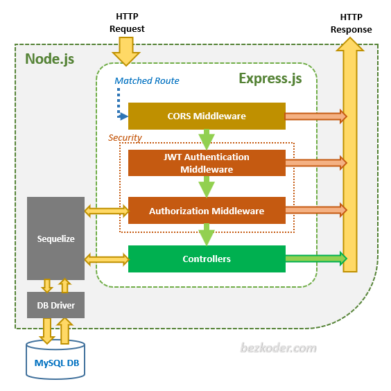
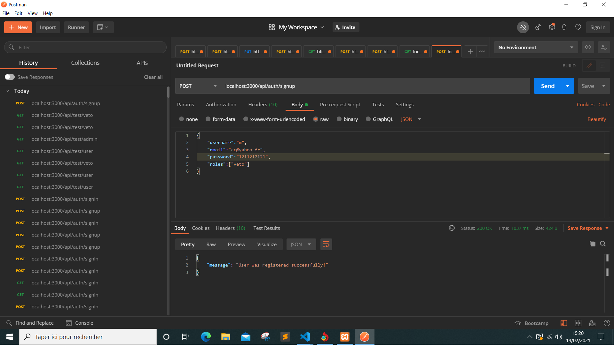
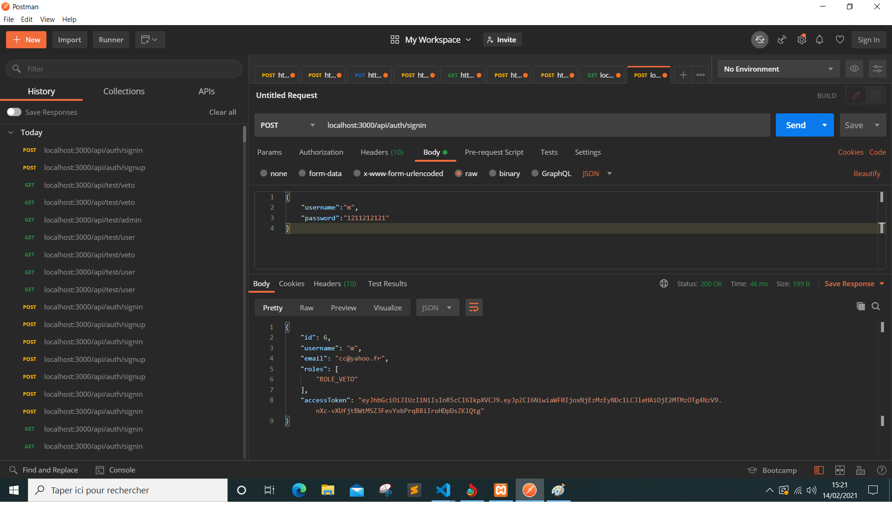
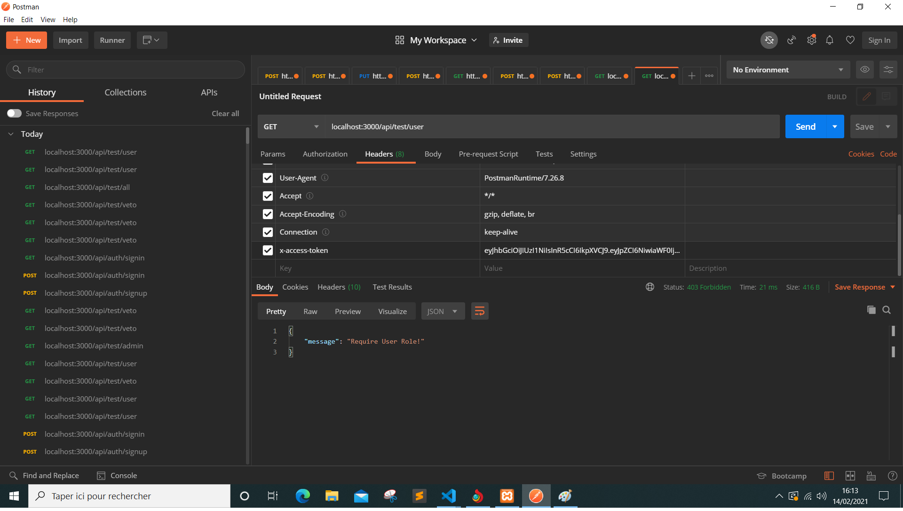

# Projet coté Js
1. npm install
2. node server.js
3. à ne pas manipuler sont les dossiers : middleware,config
4. le dossier controller contient auth.controller dédié pour l'authentification avec la verification de token
et user.controller contient les methodes que nous allons utiliser dans notre projet.
5. user designe le user par défaut et le véto aussi. Par exemple la méthode vetoBoard est utilisée pour tester la requête de demande de contenu
du veto avec la verification dans la base par les deux méthodes authJwt.verifyToken et authJwt.isVeto. Donc avant chaque demande de données on doit utiliser ces deux méthodes pour confirmer l'identité et le role. NB: il ya aussi la méthode isUser dédiée aux user normales.
6. vous allez ajouter votre code dans le fichier user.routes.js et user.controller.js c'est tout.
7. il faut créer aussi une bd nommer zanimaux comme décalré dans le fichier db.config.js
8. pour créer une table on la déclare sous models et elle sera créée par le module sequelize.
9. pour les requêtes sql vous pouvez utiliser soit le module sequelize soit mysql selon votre choix.
### Architecture:

### Tests:

